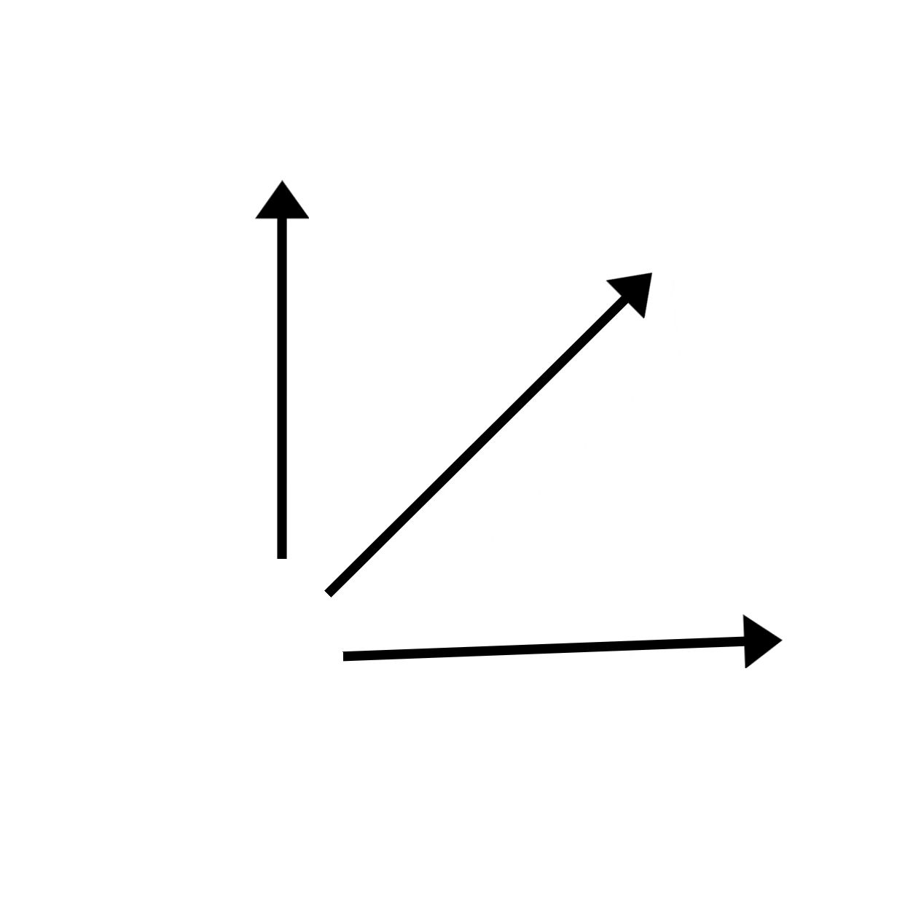

# OpenVector: Open-Source Multi-Model Integration Platform


## 🚀 Project Introduction

`OpenVector` is an innovative open-source Java library designed to simplify the integration and utilization of machine learning models. We provide a unified and powerful interface that enables developers to easily integrate pre-trained embedding models from diverse sources.

## 🎯 Project Vision

In the rapidly evolving AI landscape, accessing and utilizing high-quality pre-trained models is crucial. OpenVector is committed to addressing technical barriers in model usage, allowing developers to focus on building innovative applications.

## ✨ Core Features

- **🌐 Extensive Model Support**
  - Seamless integration of pre-trained models from platforms like Hugging Face, TensorFlow Hub, PyTorch Hub, and Alibaba Cloud
  - Support for multiple data types: text, images, audio, etc.

- **🔧 Convenient Annotation Mechanism**
  - Quickly specify and switch models through simple annotations
  - Significantly simplifies model management processes

- **🔄 Consistent API Interface**
  - Unified invocation method ensuring code portability
  - Abstracts technical differences between different models

- **⚡ High-Performance Optimization**
  - Deep performance optimization
  - Support for data processing pipelines
  - GPU acceleration
  - Intelligent resource management
 
## 🛠️ Quick Start

### Environment Preparation

- JDK 1.8+
- Maven
- CMake (Optional, for building dynamic libraries)

### Dependency Installation

```shell
1. Build dynamic library files
$ cd jdlib/jni
$ mkdir build
$ cd build
$ cmake ..
$ make 
2. Package face-dlib project
```
```xml
<!-- Local dependency example (not yet uploaded to Maven) -->
<dependency>
    <groupId>com.openvector</groupId>
    <artifactId>openvector-core</artifactId>
    <version>1.0.0</version>
</dependency>
```
### Basic Usage Example
```java
@Autowired
private VectorizeService vectorizeService;

// Quickly call models using annotations
@VectorModel(type = ModelType.TEXT_EMBEDDING)
public List<Float> embedText(String text) {
    return vectorizeService.vectorize(text);
}
```

### 📦 Module Description

`openvector-core`: System core components, defining unified vectorization interface
`openvector-db`: Vector database integration module
`openvector-provider`: Model provider implementation

#### Contribution Guidelines
1. Fork the project
2. Create Feature Branch (`git checkout -b feature/AmazingFeature`)
3. Commit your changes (`git commit -m 'Add some AmazingFeature`)
4. Push to the branch (`git push origin feature/AmazingFeature`)
5. Open a Pull Request

### 📄 License

This project is open-sourced under the Apache 2.0 License - see the [LICENSE](LICENSE) file for details

### Support and Contact

* GitHub Homepage: https://github.com/zscxc/OpenVector
* Gitee Homepage: https://gitee.com/cencxc/open-vector
* GitHub Issues: Submit Issue
* Email: 320522275@qq.com

### Sponsorship and Support

If you find this project helpful, please Star ⭐ the project!
